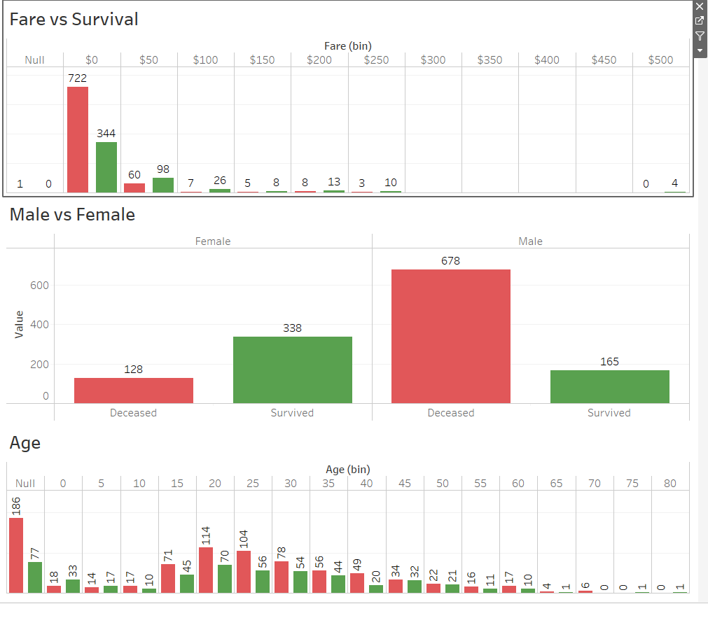

# Titanic Data Project

## Overview

The overview of our project was to see if we could determine the passengers that survived from the night the Titanic sank by way of machine learning.  We found this dataset on Kaggle that was part of a challenge for the public to compete in. We downloaded and used their training dataset file to create our machine learning model. The original training dataset had eight features and one target variable that we would use to manipulate our data. We will create dataframes using Pandas in Jupyter Notebook are cleaning up our data. We'll then be creating different models to see how accuracy changes betweeen them and see if we can find sizeable improvements between them.

Data Source: https://www.kaggle.com/competitions/titanic 

Tableau Dashboard: https://public.tableau.com/app/profile/guy6801/viz/Book2_16759938012560/Sheet1?publish=yes

## Results

### Random Forest Classifier Model

We can see in the picture above that we were able to get a Testing Score of 79.4% with this model. We also ranked our features in order of importance and can see that Fare, Age, and Gender were the most important determinants in survival

### Neural Network Model #1

We were able to attain an accuracy score of 82.1% in our first neural network model. This was a three layer neural network model that we ran with 50 ephocs

### Neural Network Model #2

We were able to attain an accuracy score of 84.3% in our second neural network model. This was another three layer neural network model that we ran with 50 ephocs

### Neural Network Model #3 

We were able to attain an accuracy score of 80.7% in our third neural network model. In this model, we addid a third hidden layer to bump to total layer number to four. We ran this model with 50 epochs.

### Keras Model

For our last model we decided to use KerasTuner to see if we would see any big improvements. We pulled the top three models and listed their results above. We can see that their accuracy ranged from 81-85% with loss values between 0.39 and 0.48.

## Summary

Our models above did a pretty good job of predicting survivors based off the features that we provided. We saw accuracy scores around 80% for all of our models. We were surprised to see that our second and third neural network models performed in line with our Keras optimizer model.

Tablleau Survival rate Analysis: [Tableau Analysis Link](https://public.tableau.com/app/profile/guy6801/viz/TitanicProject_16762110932600/Tota)

